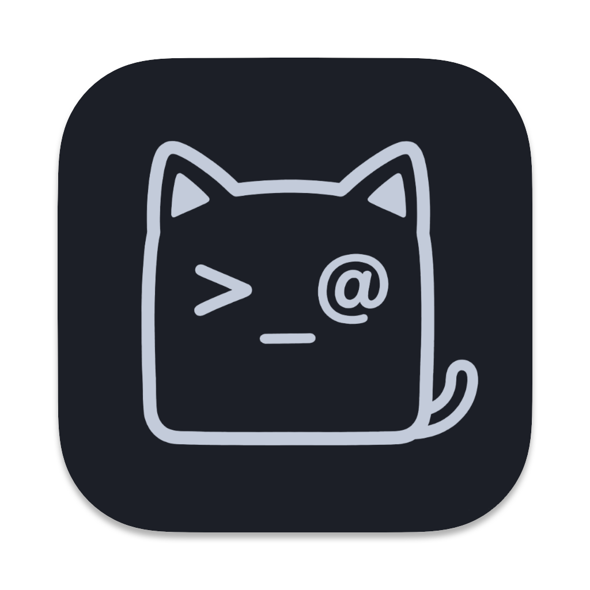

<p align="right">
<a href="./README.md">English</a> | <a href="./docs/README_zh.md">中文</a>
</p>

<h1 align="center">
<br/>
OpsKat
</h1>

<p align="center">
<b>Your one-stop server operations workbench</b><br/>
SSH, databases, Redis, Kafka, Kubernetes… everything ops has to touch, unified in a single cross-platform desktop app. And you can let AI execute it for you in natural language — every step guarded by policy and audit.
</p>

<p align="center">
<a href="https://opskat.dev/">Website</a> ·
<a href="https://opskat.dev/docs/getting-started/installation">Docs</a> ·
<a href="https://github.com/opskat/opskat/releases">Download</a>
</p>

<p align="center">
  
  &nbsp;
  
  &nbsp;
  
  &nbsp;
  
</p>

<p align="center">
  <a href="https://t.me/opskat"></a>
  &nbsp;
  <a href="https://qm.qq.com/q/sERnNKEzeg"></a>
</p>

<p align="center">
  
</p>

## 🧭 About

Managing servers usually means juggling a pile of tools — SSH clients, database GUIs, Redis managers, Kafka consoles — and constantly switching between them. OpsKat brings all of those everyday asset operations into a single interface, so one app is enough. On its own, that's already a full ops workbench.

On top of it sits a layer of AI: just say what you need in natural language, and the AI agent connects and runs it for you — pulling logs, running SQL, checking cluster status, and more. Every step is backed by policy enforcement and full audit logging, so handing work to the AI stays safe.

**If you find it useful, please give us a Star ⭐ — it means a lot!**

## ⬇️ Install

### Download

Grab the latest build for your platform — **macOS, Windows, or Linux** — from the [Releases page](https://github.com/opskat/opskat/releases). No Go/Node toolchain required: download and run. Step-by-step notes are in the [installation docs](https://opskat.dev/docs/getting-started/installation).

### First run

1. **Add an asset** — an SSH host, database, Redis, and so on — or import from your SSH config / Tabby.
2. **Connect** — open a terminal, run a query, or browse keys and collections.
3. *(Optional)* **Configure an AI provider**, then just tell the agent what you need.

## 📦 Supported Assets

| Category | Assets |
| :-- | :-- |
| **Servers** |   |
| **Databases** |   <img src="https://img.shields.io/badge/SQL_Server-CC2927?style=flat-square&logo=data%3Aimage%2Fsvg%2Bxml%3Bbase64%2CPHN2ZyBmaWxsPSJ3aGl0ZSIgcm9sZT0iaW1nIiB2aWV3Qm94PSIwIDAgMjQgMjQiIHhtbG5zPSJodHRwOi8vd3d3LnczLm9yZy8yMDAwL3N2ZyI%2BPHBhdGggZD0iTTQuNzI0IDIuNTA1cy0uMDguMTI3LS4wMDQuMzE1Yy4wNDYuMTE2LjE4Ni4yNTYuMzQuNDA0IDAgMCAxLjYxNSAxLjU3NiAxLjgxMyAxLjgwNC44OTUgMS4wMzMgMS4yODQgMi4wNSAxLjMyIDMuNDUzLjAyMi45LS4xNTEgMS42OTItLjU3MyAyLjYxMy0uNzU2IDEuNjQ5LTIuMzUgMy40NjgtNC44MSA1LjQ5bC4zNi0uMTJjLjIzMy0uMTczLjU0OC0uMzU5IDEuMjkyLS43NjYgMS43MTMtLjkzNiAzLjYzNi0xLjc5OCA1Ljk5OS0yLjY4NiAzLjM5OS0xLjI3NyA4Ljk5LTIuNzc2IDEyLjE3Mi0zLjI2M2wuMzMxLS4wNTEtLjA1LS4wOGMtLjI5Mi0uNDUyLS40OS0uNzMxLS43My0xLjAyNy0uNjk3LS44NjMtMS41NDItMS41NjctMi41NzctMi4xNDYtMS40MjItLjc5Ny0zLjI2Ny0xLjQxNi01LjYtMS44OGE2Ny45MyA2Ny45MyAwIDAwLTIuMTkxLS4zNzUgMjA5LjI5IDIwOS4yOSAwIDAxLTMuOTI0LS42NGMtLjQyNS0uMDc1LTEuMDYtLjE4MS0xLjQ4MS0uMjcyYTkuNDA0IDkuNDA0IDAgMDEtLjk2MS0uMjU4Yy0uMjY4LS4xMDUtLjY0NS0uMjA3LS43MjYtLjUxNXptLjkzNi45MDljLjAwMy0uMDAyLjA2My4wMTcuMTM3LjA0Mi4xMzYuMDQ2LjMxNi4xLjUyNi4xNTkuMTQ2LjA0LjMwNy4wODQuNDc5LjEyNy4yMTguMDU2LjM5OS4xMDQuNDAxLjEwNy4wMjQuMDI3LjM5MSAxLjE5OC41MTYgMS42NDcuMDQ4LjE3Mi4wODQuMzE1LjA4MS4zMThhLjc4OS43ODkgMCAwMS0uMDktLjE0Yy0uNDI0LS43NDYtMS4wOTctMS41MDUtMS44NzQtMi4xMTZhMy4xMDQgMy4xMDQgMCAwMS0uMTc2LS4xNDR6bTEuNzkuNDk0Yy4wMTgtLjAwMS4wOTkuMDEyLjE5NS4wMzQuNjE5LjEzNiAxLjcyNS4zNSAyLjQzNS40Ny4xMTkuMDIuMjE2LjA0LjIxNi4wNDdhLjM0OC4zNDggMCAwMS0uMDk4LjA2MmMtLjExOS4wNi0uNjAyLjM0OS0uNzYzLjQ1Ny0uNDAzLjI3LS43NjYuNTU5LTEuMDMuODIxYTUuNCA1LjQgMCAwMS0uMTk3LjE5MmMtLjAwMyAwLS4wMjItLjA2Mi0uMDQxLS4xMzdhMTIuMDkgMTIuMDkgMCAwMC0uNjUtMS43NzkgMS44MDEgMS44MDEgMCAwMS0uMDcxLS4xNjVjMC0uMDAxIDAtLjAwMi4wMDQtLjAwMnptMy4xNDcuNTk4Yy4wMi4wMDcuMDYuMTMuMTI5LjQwNGE2LjA1IDYuMDUgMCAwMS4xNTMgMS45NzdsLS4wMTIuMDM4LS4xODctLjA2Yy0uMzg4LS4xMjQtMS4wMi0uMzEtMS41NjItLjQ2YTYuNjI1IDYuNjI1IDAgMDEtLjU2LS4xN2MwLS4wMjIuNDQ5LS40NzEuNjQyLS42NDIuMzY5LS4zMjYgMS4zNjItMS4wOTggMS4zOTctMS4wODd6bS4yNS4wMzZjLjAxMS0uMDEgMS41MDQuMjQ4IDIuMTgyLjM3OC41MDYuMDk3IDEuMjM3LjI1IDEuMjgxLjI2OS4wMjIuMDA4LS4wNTQuMDUtLjI5Ny4xNi0uOTYuNDMyLTEuNjcyLjgyLTIuMzggMS4yOTMtLjE4Ni4xMjQtLjM0MS4yMjYtLjM0NC4yMjYtLjAwNCAwLS4wMDYtLjEwNC0uMDA2LS4yMyAwLS42OS0uMTM5LTEuMzg3LS4zOTEtMS45NzZhLjY4OC42ODggMCAwMS0uMDQ1LS4xMnptMy44Ni43NjRjLjAxMS4wMTEtLjAzOC4zMDYtLjA4LjQ4LS4xMzIuNTQtLjQ4MiAxLjM0NC0uOTE0IDIuMDk5YTIuMjYgMi4yNiAwIDAxLS4xNTIuMjQ2IDEuNDk5IDEuNDk5IDAgMDEtLjIxOS0uMTE1Yy0uNDIyLS4yNDctLjktLjQ4LTEuNDI1LS42OTdhNC41ODggNC41ODggMCAwMS0uMjc4LS4xMmMtLjAyNC0uMDIyIDEuMTQzLS43OTUgMS43NjItMS4xNjYuNDk1LS4yOTcgMS4yOTItLjc0MSAxLjMwNi0uNzI3em0uMjc2LjA0M2MuMDMzIDAgLjY5NS4xOCAxLjAzNy4yODMuODUzLjI1NSAxLjgzNy42MTQgMi40NzUuOTA0bC4yNjUuMTItLjE4Ny4wNDNjLTEuNTYxLjM2LTIuOS43NzMtNC4xODggMS4yOTYtLjEwNy4wNDQtLjIuMDgtLjIwNy4wOGEuOTExLjkxMSAwIDAxLjA3NS0uMTg1Yy4zODgtLjgyMy42MzgtMS42ODcuNzAzLTIuNDIuMDA2LS4wNjcuMDE4LS4xMjEuMDI3LS4xMjF6bS02LjU4IDEuNTEyYy4wMS0uMDEuNTE0LjEwOC43ODkuMTg1LjQxMy4xMTYgMS4yOTIuNDEgMS4yOTIuNDMzIDAgLjAwNC0uMDk3LjA4OS0uMjE1LjE4OC0uNDc1LjM5Ny0uOTM0LjgxMy0xLjQ4MyAxLjM0M2E1LjI3IDUuMjcgMCAwMS0uMzA4LjI4NWMtLjAwNyAwLS4wMS0uMDIzLS4wMDYtLjA1LjA4My0uNjExLjA2NS0xLjM5NS0uMDUtMi4xOTNhMS4yOSAxLjI5IDAgMDEtLjAyLS4xOXptMTAuNjEuMDFjLjAwNy4wMDgtLjIzNC4zODUtLjM4NC42LS4yMi4zMTQtLjUzNy43MjYtMS4yNjEgMS42MzdsLS45NTQgMS4yMDJhOS40MTggOS40MTggMCAwMS0uMjY5LjMzM2MtLjAwMyAwLS4wNS0uMDY2LS4xMDMtLjE0NmE3LjU4NCA3LjU4NCAwIDAwLTEuNDctMS42MjUgOS41OSA5LjU5IDAgMDAtLjI3LS4yMTguNDI3LjQyNyAwIDAxLS4wNzQtLjA2M2MwLS4wMS42MTctLjI3NCAxLjA4OC0uNDY2YTM3LjAyIDM3LjAyIDAgMDEyLjc3OC0uOTljLjQ0Mi0uMTM1LjkxMi0uMjcuOTE5LS4yNjR6bS4yNzguMDczYS45My45MyAwIDAxLjIwNy4xIDEyLjI3NCAxMi4yNzQgMCAwMTIuNDI4IDEuODI0Yy4xOTQuMTkuNjY3LjY4My42Ni42ODdsLS4zNjMuMDI5Yy0xLjUzLjExNS0zLjQ4Ni40NC01LjM3Ljg5My0uMTI4LjAzLS4yMzguMDU2LS4yNDYuMDU2LS4wMDcgMCAuMTMzLS4xNC4zMTEtLjMxMiAxLjEwNy0xLjA2MyAxLjYxMS0xLjczNCAyLjIwNS0yLjkzNC4wODgtLjE3OC4xNjMtLjMzMy4xNjYtLjM0MmguMDAyem0tOC4wODguODNjLjA1MS4wMS41MjMuMjMuODc5LjQwOC4zMjUuMTYzLjgxOC40MjYuODQzLjQ0OS4wMDMuMDAzLS4xNy4wOTMtLjM4Ni4yMDEtLjY4My4zNDItMS4yNjguNjY0LTEuODc4IDEuMDM3LS4xNzUuMTA3LS4zMi4xOTQtLjMyNS4xOTQtLjAxNSAwLS4wMS0uMDEzLjA4OC0uMTkxYTcuNzAyIDcuNzAyIDAgMDAuNzM4LTIuMDAyYy4wMTQtLjA2Mi4wMy0uMS4wNDEtLjA5N3ptLS40NzUuMDg0Yy4wMS4wMS0uMTEyLjQ2LS4xOS43YTkuMDkyIDkuMDkyIDAgMDEtLjgzNSAxLjgwOGwtLjA5LjE0Ny0uMjAzLS4xOTdhMi42NzEgMi42NzEgMCAwMC0uNjc2LS41IDEuMDA5IDEuMDA5IDAgMDEtLjE3Ni0uMTAyYzAtLjAzLjYyLS41OTMgMS4wOTgtLjk5OC4zNDMtLjI5IDEuMDY0LS44NjcgMS4wNzItLjg1OHptMi44ODggMS4xODhsLjE3Ny4xMTVjLjQwNy4yNjQuODg4LjYxOSAxLjI1NS45MjQuMjA2LjE3Mi42MDUuNTMuNjg3LjYxNmwuMDQ0LjA0Ny0uMjk0LjA4MmE1My44IDUzLjggMCAwMC00LjQ1IDEuNDI0Yy0uMTY3LjA2MS0uMzEuMTEyLS4zMi4xMTItLjAyMSAwLS4wNDIuMDE5LjMzMy0uMzI2Ljk2LS44ODMgMS44MDctMS44NTYgMi40NC0yLjgwMnptLS43NTkuMTljLjAwOS4wMDktLjQ5Mi43MS0uNzg5IDEuMTA2LS4zNTYuNDczLS45OSAxLjI2NS0xLjQyNiAxLjc4YTguNzY5IDguNzY5IDAgMDEtLjM0Ni4zOTdjLS4wMS4wMDMtLjAxNS0uMDUtLjAxNi0uMTMzIDAtLjQ0LS4xMTItLjkxLS4zMDgtMS4zMDgtLjA4My0uMTY4LS4wOTctLjIwOC0uMDgtLjIyNC4wNjgtLjA2MiAxLjEyNy0uNjY2IDEuNzk0LTEuMDIzLjQ1OS0uMjQ2IDEuMTYzLS42MDQgMS4xNzEtLjU5NXptLTQuNTkgMS4xMjVhMy45ODggMy45ODggMCAwMS44MTIuNTE4Yy4wMDguMDA1LS4wODcuMDgzLS4yMS4xNzItLjM0NS4yNDktLjg3LjY0NC0xLjE3My44ODYtLjMyLjI1NS0uMzMxLjI2My0uMjk1LjIwNy4yNC0uMzY3LjM2LS41NzQuNDg2LS44NC4xMTMtLjIzNi4yMjQtLjUxNi4zMDQtLjc2YS42NzUuNjc1IDAgMDEuMDc3LS4xODN6bTEuMjIzLjk2Yy4wMTctLjAwMy4wNC4wMjguMTM5LjE3NS4yMDcuMzEuMzY2LjcyMi40MDcgMS4wNThsLjAwOC4wNzMtLjQ5Ny4xOTJjLS44OS4zNDYtMS43MTEuNjg3LTIuMjY2Ljk0LS4xNTUuMDcyLS40MjguMjAyLS42MDcuMjkyLS4xNzkuMDktLjMyNS4xNi0uMzI1LjE1NiAwLS4wMDQuMTEyLS4wODkuMjUtLjE4OCAxLjA4Ny0uNzkgMi4wMjUtMS42NTQgMi43MzItMi41MTkuMDc1LS4wOTIuMTQ0LS4xNzIuMTUzLS4xNzhhLjAxNi4wMTYgMCAwMS4wMDYtLjAwMnptLS41NjQuMTRjLjAxNS4wMTQtLjQwMS40ODQtLjY4MS43Ny0uNy43MTUtMS4zOTYgMS4yNzUtMi4yNTYgMS44MjEtLjEwOC4wNjktLjIwNi4xMy0uMjIuMTM4LS4wMjMuMDE0LjAwOC0uMDIyLjM4Ni0uNDM0LjIzOC0uMjU5LjQyLS40NzQuNjI4LS43NDMuMTM2LS4xNzcuMTYyLS4yMDIuMzYyLS4zNDYuNTM3LS4zODggMS43NjctMS4yMjEgMS43ODEtMS4yMDd6TTkuOTI1IDBjLS4wOC0uMDEtMS4zNzEuNDU1LTIuMi43OTEtMS4xMjMuNDU3LTEuOTk2Ljg5NC0yLjUzNCAxLjI3Mi0uMi4xNC0uNDUyLjM5My0uNDg4LjQ5YS4zNTYuMzU2IDAgMDAtLjAyMS4xMjNsLjQ4OC40NiAxLjE1OC4zN0w5LjA4NyA0bDMuMTUzLjU0Mi4wMzItLjI3LS4wMjgtLjAwNS0uNDE1LS4wNjYtLjA4NS0uMTQ4YTI3LjcwMiAyNy43MDIgMCAwMS0xLjE3Ny0yLjMyNSAxMi4yNjQgMTIuMjY0IDAgMDEtLjUzLTEuNDY1QzkuOTY5LjAyIDkuOTYyLjAwNSA5LjkyNSAwem0tLjA2MS4xODZoLjAwNWMuMDAzLjAwMy4wMTcuMTA1LjAzMi4yMjUuMDYyLjUwOC4xNzYgMSAuMzU0IDEuNTMuMTM0LjQuMTM2LjM3Ny0uMDI0LjMzMi0uMzctLjEwMy0yLjAzMi0uMzg4LTMuMjM0LS41NTVhOC43OTYgOC43OTYgMCAwMS0uMzU3LS4wNTNjLS4wMTUtLjAxNS44NjctLjQ3NyAxLjI1OC0uNjYuNTAxLS4yMzIgMS44NjctLjggMS45NjYtLjgxOXpNNi4zNjIgMS44MTRsLjE0MS4wNDhjLjc3Mi4yNjIgMi43MDYuNjMyIDMuNzc1LjcyLjEyLjAxLjIyMi4wMjEuMjI1LjAyNC4wMDMuMDAzLS4xLjA1OC0uMjI4LjEyMi0uNTE1LjI1OC0xLjA4My41NzMtMS40NzYuODE5LS4xMTUuMDcyLS4yMi4xMy0uMjM1LjEyOWE0Ljg2OCA0Ljg2OCAwIDAxLS4xNy0uMDI3bC0uMTQ0LS4wMjMtLjM2NS0uMzU1Yy0uNjQxLS42Mi0xLjE0MS0xLjEtMS4zMzUtMS4yOHptLS4xNDMuMTE0bC41MTEuNjM4Yy4yODIuMzUuNTY0LjY5OS42MjYuNzc0LjA2My4wNzUuMTExLjEzOC4xMDguMTQtLjAxNC4wMTEtLjc0LS4xMy0xLjEyNS0uMjE5YTguNTMyIDguNTMyIDAgMDEtLjgwMy0uMjEybC0uMi0uMDY0LjAwMS0uMDQ5Yy4wMDMtLjI0NS4zMTItLjYwNy44MzYtLjk3NnptNC4zNTIuODY5Yy4wMTUuMDAxLjAzMi4wMzIuMDc3LjEzMS4xMjQuMjcyLjUxIDEuMDA4LjYwMyAxLjE1LjAzLjA0Ny4wOC4wNS0uNDMzLS4wMzMtMS4yMy0uMTk4LTEuNjI5LS4yNjUtMS42MjktLjI3M2EuMzYuMzYgMCAwMS4wODMtLjA1NCA3LjEzIDcuMTMgMCAwMDEuMTA3LS43NjdsLjE3NS0uMTQ3Yy4wMDYtLjAwNS4wMTItLjAwOC4wMTctLjAwN3ptNC4zMDkgOC40MDhsLTQuODA4IDEuNTY4LTQuMTggMS44NDYtMS4xNy4zMWMtLjI5OC4yODItLjYxMy41NjgtLjk0OC44Ni0uMzcuMzIxLS43MTYuNjEyLS45OC44MjJhNy40NiA3LjQ2IDAgMDAtLjk1My45NDVjLS4zMzIuNDE0LS41OTIuODU0LS43MDQgMS4xOTMtLjIuNjEtLjEwMyAxLjIyOC4yODUgMS43OTguNDk1LjcyOCAxLjQ4IDEuNDY4IDIuNjI1IDEuOTcyLjU4NS4yNTYgMS41Ny41ODggMi4zMS43NzQgMS4yMzMuMzEyIDMuNjE0LjY1IDQuOTI2LjcuMjY2LjAxLjYyLjAxLjYzNy0uMDAyLjAyOC0uMDE5LjIzMy0uNDA1LjQ3LS44OS44MDYtMS42NDYgMS4zODktMy4xOSAxLjcwMy00LjUwOC4xOS0uNzk5LjMzOC0xLjg2My40MzQtMy4xMjUuMDI3LS4zNTQuMDM3LTEuNTMzLjAxNi0xLjkzNGExMy41NjQgMTMuNTY0IDAgMDAtLjE4My0xLjcwNi40MzUuNDM1IDAgMDEtLjAxMi0uMTVjLjAxNC0uMDEuMDU5LS4wMjUuNjUtLjE5N3ptLTEuMS42NDVjLjA0NSAwIC4xNiAxLjExNC4xOTEgMS44Mi4wMDYuMTUxLjAwNS4yNDctLjAwNC4yNDctLjAyOCAwLS42MTUtLjM0NS0xLjAzMi0uNjA2YTI4LjcxNiAyOC43MTYgMCAwMS0xLjE2Mi0uNzcyYy0uMDM1LS4wMjgtLjAzMS0uMDI5LjI2Ni0uMTMxLjUwNS0uMTc0IDEuNzA0LS41NTggMS43NDItLjU1OHptLTIuNDQ4LjgwM2MuMDMgMCAuMTE1LjA0Ny4zMTUuMTcyLjc1LjQ3IDEuNzY2IDEuMDM1IDIuMiAxLjIyNS4xMzYuMDYuMTUxLjAzNi0uMTYuMjQ3LS42NjIuNDUtMS40ODYuODkyLTIuNDk3IDEuMzQyYTcuNTkgNy41OSAwIDAxLS4zMzEuMTQyLjk4OS45ODkgMCAwMS4wNDMtLjJjLjI0NS0uOTA1LjM4My0xLjgyLjM4Ny0yLjU1NC4wMDItLjM2Mi4wMDItLjM2NC4wMzctLjM3M2guMDA2em0tLjUwNC4xOTNjLjAyMS4wMjIuMDA2LjgzNC0uMDIgMS4wNTZhOS4yMDYgOS4yMDYgMCAwMS0uNDE4IDEuODM3Yy0uMDE0LjAxNy0uNTExLS40NjgtLjY3Ni0uNjZhNC45MTggNC45MTggMCAwMS0uNjY5LS45NzNjLS4wODItLjE2Mi0uMjE0LS40ODQtLjIwMi0uNDkzLjA1Ni0uMDQgMS45NzEtLjc4IDEuOTg1LS43Njd6bS0yLjM3NS45MzZjLjAwNCAwIC4wMDguMDAxLjAxLjAwNGEuODgxLjg4MSAwIDAxLjA1Ni4xMzFjLjExNi4zMTUuMzc2Ljc4Mi42MDIgMS4wOGE2LjI0NyA2LjI0NyAwIDAwMS4wMTcgMS4wNmMuMDIzLjAyLjAzLjAxNi0uNTYyLjI0YTQ4LjUzIDQ4LjUzIDAgMDEtMi4yOTQuOGMtLjMyNy4xMDYtLjYwNC4xOTUtLjYxNS4yLS4wMzMuMDExLS4wMjMtLjAwOS4wNzMtLjE1OC40MjctLjY2NiAxLjA3My0xLjk3IDEuNDM1LTIuODkyLjA2Mi0uMTYuMTIyLS4zMi4xMzMtLjM1Ni4wMTUtLjA1Mi4wMzEtLjA3LjA4LS4wOTJhLjE0OS4xNDkgMCAwMS4wNjUtLjAxN3ptLS43MjguM2MuMDEuMDA5LS4xNzQuMzk4LS4zNTYuNzUxLS4zNTEuNjg2LS43MzkgMS4zNjEtMS4yNTMgMi4xODVsLS4xODIuMjg4Yy0uMDE4LjAyNy0uMDI2LjAxOC0uMDgyLS4wOTRhMy4zMDcgMy4zMDcgMCAwMS0uMjgtLjg0MiAzLjM5IDMuMzkgMCAwMS4wMi0xLjA4M2MuMDQ3LS4yMjcuMDQ1LS4yMjIuMTUyLS4yNzYuNDYyLS4yMzcgMS45NjYtLjk0MiAxLjk4MS0uOTI5em02LjI2OC4yNTV2LjE1NGEyMC4xMDYgMjAuMTA2IDAgMDEtLjI1NSAyLjk5MiA5LjM2MiA5LjM2MiAwIDAxLTEuODk4LS43ODJjLS4zNTQtLjE5NC0uODY1LS41MDctLjg1LS41MjIuMDAzLS4wMDQuMTU0LS4wODMuMzM0LS4xNzcuNzE0LS4zNyAxLjM5NS0uNzcgMS45ODgtMS4xNjYuMjIyLS4xNDguNTU1LS4zODkuNjI5LS40NTR6TTQuOTgxIDE1LjQxYy4wMTUgMCAuMDExLjAyOC0uMDEyLjE2MWE0LjEzNyA0LjEzNyAwIDAwLS4wNDEuMzljLS4wMy41MzIuMDU3LjkyNC4zMiAxLjQ2LjA3NC4xNS4xMzIuMjc0LjEyOS4yNzYtLjAyNy4wMjMtMi40My43MjYtMy4xODYuOTMzbC0uNDM1LjEyYy0uMDI3LjAwOC0uMDI5LjAwMi0uMDItLjA2LjA4My0uNTMzLjQ5LTEuMjMyIDEuMDU4LTEuODIuMzc4LS4zOS42OC0uNjIyIDEuMTk1LS45MTVhMzAuNzgyIDMwLjc4MiAwIDAxLjk5Mi0uNTQ1em01LjY2OSAxLjAxNWMuMDAyLS4wMDIuMDkxLjA0NS4xOTcuMTA3Ljc3Ny40NDkgMS44Ni44NyAyLjc4MyAxLjA4MWwuMDg0LjAyLS4xMTUuMDYzYy0uNDgyLjI2OC0yLjA3MS45MjktMy42OTQgMS41MzdhNjguODIgNjguODIgMCAwMC0uNTEzLjE5NC4zMTQuMzE0IDAgMDEtLjA4Mi4wMjdjMC0uMDA0LjA2Ny0uMTMyLjE0OS0uMjg2LjQ1Ni0uODUyLjkxLTEuODg3IDEuMTQ0LTIuNjA1LjAyMy0uMDczLjA0NC0uMTM1LjA0Ny0uMTM4em0tLjU3OC4xOWExLjM5IDEuMzkgMCAwMS0uMDYzLjE2OSAyMy41MzQgMjMuNTM0IDAgMDEtMS4yNjEgMi41NCA5LjAwOSA5LjAwOSAwIDAxLS4yNTIuNDMzYy0uMDA1IDAtLjExNC0uMDY2LS4yNDQtLjE0NS0uNzctLjQ3Mi0xLjQ1Mi0xLjA1Mi0xLjktMS42MTdsLS4wNjQtLjA4LjMzMi0uMDkxYTIzLjYxNiAyMy42MTYgMCAwMDMuMTktMS4xMDNjLjE0Mi0uMDYuMjYtLjEwOS4yNjItLjEwNnptMy41OSAxLjI1M2MuMDAxIDAgLjAwMi4wMDEuMDAyLjAwMyAwIC4wOC0uMTgzLjgyOC0uMzM2IDEuMzctLjEyOC40NTMtLjIzNi44MDgtLjQzNSAxLjQzN2E4LjUzMyA4LjUzMyAwIDAxLS4xNjguNTA0IDE1LjAwNCAxNS4wMDQgMCAwMS0zLS44NDEgNy45NjQgNy45NjQgMCAwMS0uNjM5LS4yODNjLS4wMDYtLjAwNy4yMTMtLjExLjQ4Ni0uMjMgMS42NTUtLjcyMSAzLjM2OS0xLjU0MyAzLjk1NS0xLjg5NmEuNDMyLjQzMiAwIDAxLjEzNS0uMDY0em0tOC4yODcuMjgzYy4wMDkuMDA5LS40NTQuNjcxLTEuMSAxLjU3NmwtLjU4Ny44MjNjLS4wOTcuMTM5LS4yNDUuMzU4LS4zMjkuNDg4bC0uMTUzLjIzNi0uMTYyLS4xMzdjLS4xOTEtLjE2LS41MjUtLjUwMS0uNjc3LS42OS0uMzEyLS4zODktLjUyMy0uNzk4LS42MDctMS4xNzQtLjAzOC0uMTc0LS4wNC0uMjYyLS4wMDMtLjI3M2ExNzYuMjYgMTc2LjI2IDAgMDExLjkzNC0uNDU1bDEuMy0uMzA1Yy4yMDktLjA1LjM4Mi0uMDkuMzg0LS4wODl6bS40NjUuMTc4bC4xMTcuMTMxYTYuNzYzIDYuNzYzIDAgMDAxLjcwNiAxLjM5NGMuMTE1LjA2Ni4yMDIuMTI0LjE5NS4xMjhhMjgxLjk2NyAyODEuOTY3IDAgMDEtNC4zMyAxLjUzLjg1OC44NTggMCAwMS0uMDcyLS4wNDhsLS4wNjctLjA0OC4xMDUtLjE1MmMuMzQtLjQ5My43NjgtMS4wMzUgMS43MDUtMi4xNjJ6bTIuOSAyLjA3M2MuMDAzLS4wMDMuMTY1LjA1NC4zNjIuMTI4LjQ3My4xNzcuODQ0LjI5MiAxLjM0Ny40MTguNjE3LjE1NSAxLjUxLjMxIDIuMDM4LjM1NC4wOC4wMDYuMTIyLjAxNi4xMS4wMjQtLjAyNS4wMTYtLjU2LjE5NC0uOTUzLjMxOGEyNTguNTI2IDI1OC41MjYgMCAwMS00LjYzNiAxLjM2M2MtLjAzNS4wMDctLjE1Ny0uMDI1LS4xNTctLjA0IDAtLjAwOS4wODctLjExOS4xOTMtLjI0NmEyMi4wMjcgMjIuMDI3IDAgMDAxLjQ3Ni0xLjk4NCA1Ni45IDU2LjkgMCAwMS4yMi0uMzM1em0tLjY0Mi4wMThjLjAwNS4wMDUtLjI1My40MTgtLjcwNiAxLjEzMi0uMTkyLjMwMS0uNDA5LjY0NS0uNDgzLjc2Mi0uMDc1LjExOC0uMTg0LjI5OC0uMjQyLjRsLS4xMDcuMTg1LS4wNTQtLjAxNGMtLjEzLS4wMzUtMS4wNDktLjM2LTEuMjkxLS40NTYtLjMwMS0uMTItLjYxNS0uMjY0LS44NDYtLjM4OS0uMjg5LS4xNTYtLjY1NS0uMzg4LS42MjctLjM5N2wxLjEwNS0uMzAyYzEuNTkyLS40MzQgMi40NzMtLjY4MyAzLjA1LS44NjQuMTA5LS4wMzMuMTk5LS4wNTkuMi0uMDU3em00LjUyMyAxLjA2MWguMDA2Yy4wMTUuMDM4LS41NzUgMS42Ny0uNzkgMi4xODgtLjA0OS4xMTYtLjA2Ni4xNDUtLjA5Mi4xNDNhNTUuNTQgNTUuNTQgMCAwMS0xLjQzMy0uMmMtLjkwNi0uMTM4LTIuNDIzLS40MDMtMi44MDYtLjQ5bC0uMDg5LS4wMi41NDMtLjEyMmMxLjE2NC0uMjYyIDEuNzIzLS40MDMgMi4yOS0uNTc3YTE2LjU0NCAxNi41NDQgMCAwMDIuMTM4LS44MjRjLjExMy0uMDUyLjIxLS4wOTMuMjMzLS4wOThaIi8%2BPC9zdmc%2B" alt="SQL Server">     |
| **Middleware** |   |

_More asset types are on the way via the plugin system._

## 🖥️ A Complete Ops Workbench

Even before you turn on the AI, OpsKat is a full-featured terminal and asset manager:

- Tree-structured grouping for every supported asset type
- Split-pane terminal with customizable themes
- SFTP file browser
- Jump host chain connections
- SQL query editor (MySQL/PostgreSQL via SSH tunnel)
- Redis command execution with key browser
- MongoDB collection browsing and query execution
- Kafka cluster, topic, message, consumer group, ACL, Schema Registry, and Kafka Connect management
- Port forwarding and SOCKS proxy
- Encrypted credential storage
- Import from SSH config / Tabby

## 🤖 Let AI Operate for You

Configure an AI provider and you can describe what you need in plain language — the agent connects and does it for you:

- **"Show me the recent nginx error logs on web-01"** → AI automatically SSHs in, runs the command, and returns the results
- **"Count users by status in the db-prod users table"** → AI connects to the database via SSH tunnel and executes the SQL query
- **"List lagging Kafka consumer groups in kafka-prod"** → AI checks Kafka metadata and group lag under policy control
- **"Check the health of the k3s cluster"** → AI runs kubectl commands and summarizes node and pod status

### How the AI works

- **Bring your own key** — configure any **OpenAI- or Anthropic-compatible** provider; your API key is encrypted and stored locally.
- **Use almost any model** — OpenAI, Anthropic (Claude), DeepSeek, Gemini, Qwen, GLM, Kimi, MiniMax… or a self-hosted/local endpoint (e.g. an OpenAI-compatible Ollama).
- **Direct connection** — OpsKat talks to the model you configure directly; nothing is relayed through our servers, and you are not locked into any vendor.
- **You stay in control** — the AI only proposes actions; every command runs from your machine against your servers, under the policy and audit controls below.

## 🛡️ Security & Audit

Giving AI permission to operate on your servers — how do you keep it safe?

- **Operation policies** — SSH/serial commands, SQL statements, Redis, MongoDB, Kafka, Kubernetes, and etcd operations all support allow/deny lists. SQL is analyzed by a parser that automatically blocks dangerous operations like DELETE/UPDATE without WHERE clauses
- **Policy groups** — Built-in templates (Linux read-only, dangerous command deny, etc.) plus custom user-defined groups
- **Pre-approved permissions** — AI or opsctl can request a batch of command patterns upfront. Once approved, matching commands execute automatically without per-command confirmation
- **Audit logs** — Every operation is automatically recorded: who, when, which server, what command, and the full decision trail

## 🎥 Demo

https://github.com/user-attachments/assets/2af6e52e-637c-4398-9c8b-8b39b4238b12

https://github.com/user-attachments/assets/035fc0df-230c-456b-87bd-8a4a125feaec

## ⌨️ opsctl — CLI & AI Coding Tool Integration

> For CLI users and AI coding assistants. If you only use the desktop app, you can skip this.

OpsKat ships a standalone CLI tool (`opsctl`), primarily designed for AI coding assistants like **Claude Code**, **Codex**, and **Gemini CLI**. One-click skill installation from the desktop app teaches these AI assistants to use `opsctl` — so they can directly manage servers, check logs, query databases, and troubleshoot production issues.

When the desktop app is running, opsctl reuses its connection pool and approval workflow, with all operations subject to the same policy enforcement and audit logging.

You can also use it manually:

```bash
opsctl exec web-01 -- tail -n 100 /var/log/nginx/error.log
opsctl sql db-prod "SELECT status, COUNT(*) FROM users GROUP BY status"
opsctl ssh web-01
```

## 🛠️ Tech Stack

| | |
|---------|------------|
| Desktop | [Wails v2](https://wails.io/) (Go + Web) |
| Frontend | React 19 + TypeScript + Tailwind CSS |
| Backend | Go 1.26, SQLite |

## 🔧 Build from Source

> For contributors. If you just want to use OpsKat, see **Install** above.

**Prerequisites:** [Go 1.26+](https://go.dev/), [Node.js 22+](https://nodejs.org/) with [pnpm](https://pnpm.io/), [Wails v2 CLI](https://wails.io/docs/gettingstarted/installation)

```bash
make install        # Install frontend dependencies
make dev            # Development mode (hot reload)
make build          # Production build
make build-embed    # Production build with embedded opsctl
make build-cli      # Build opsctl CLI only
```

## ❓ FAQ

**Is it free?** Yes — OpsKat is open source under [GPLv3](./LICENSE).

**Which AI models does it support, and do I need an API key?** You bring your own key for any OpenAI- or Anthropic-compatible provider (OpenAI, Claude, DeepSeek, Gemini, Qwen, GLM, Kimi, and more). See [How the AI works](#how-the-ai-works).

**Does my data pass through your servers?** No. OpsKat connects directly to the model endpoint you configure and to your own servers — nothing is relayed through us, and credentials are encrypted locally.

**Can I use it without the AI?** Absolutely. It is a complete terminal and asset manager on its own.

**Does it work on an intranet or offline?** Asset connections are direct, so they work on private networks. For AI features, point it at an internal or self-hosted model endpoint.

---

## 🤝 Contributing

We welcome all forms of contribution! Read the [Contributing Guide](./CONTRIBUTING.md) for development setup, commit conventions, and the PR process, then check out the issues or submit a pull request.

---

## 📄 License

This project is open-sourced under the [GPLv3](./LICENSE) license.

## 🔗 Links

- [LINUX DO](https://linux.do/)
