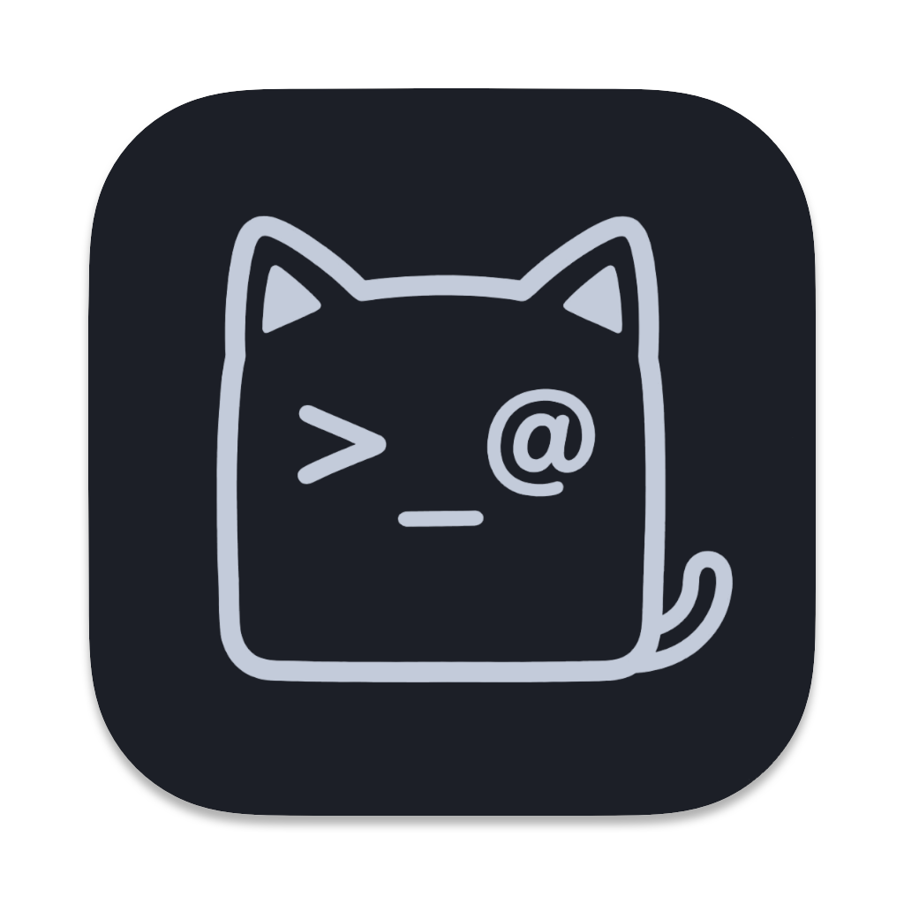

<p align="right">
<a href="../README.md">English</a> | <a href="./README_zh.md">中文</a>
</p>

<h1 align="center">
<br/>
OpsKat
</h1>

<p align="center">
<b>一站式服务器运维工作台</b><br/>
SSH 与 RDP、数据库、对象存储、Redis、Kafka、Kubernetes…… 运维要碰的一切，统一在一个跨平台桌面应用里。支持的操作还能让 AI 用自然语言替你执行，并按各条路径应用相应的策略、审批与审计控制。
</p>

<p align="center">
<a href="https://opskat.dev/">官网</a> ·
<a href="https://opskat.dev/docs/getting-started/installation">文档</a> ·
<a href="https://github.com/opskat/opskat/releases">下载</a>
</p>

<p align="center">
  
  &nbsp;
  
  &nbsp;
  
  &nbsp;
  
</p>

<p align="center">
  <a href="https://t.me/opskat"></a>
  &nbsp;
  <a href="https://qm.qq.com/q/sERnNKEzeg"></a>
</p>

<p align="center">
  
</p>

## 🧭 关于

管服务器平时要在一堆工具之间来回切：SSH 客户端、数据库 GUI、Redis 管理器、Kafka 控制台…… OpsKat 把这些常用的资产操作收进同一个界面，一个应用就够了——光是这样，它就已经是个完整的运维工作台。

在这之上再加一层 AI：直接用自然语言说需求，AI Agent 可通过已注册工具查日志、跑 SQL、看集群状态等。适用的操作会经过各自的策略与审批路径，工具调用则记录审计轨迹和可用的决策上下文。

**如果觉得有用，求个 Star ⭐ 这是对我们最大的支持！**

## ⬇️ 安装

### 下载

到 [Releases 页面](https://github.com/opskat/opskat/releases) 下载对应平台（**macOS / Windows / Linux**）的安装包，下载即用，无需 Go/Node 等开发环境。详细步骤见 [安装文档](https://opskat.dev/docs/getting-started/installation)。

### 首次使用

1. **添加资产** —— SSH/RDP 主机、数据库、对象存储、Redis 等，也可以从 SSH config / Tabby / WindTerm 导入。
2. **连接** —— 打开终端或远程桌面、跑查询，或浏览 Key、集合、Bucket 与对象。
3. *（可选）* **配置 AI 服务商**，然后直接跟 AI 说你想做什么。

## 📦 支持的资产

| 分类 | 资产 |
| :-- | :-- |
| **服务器 & 终端** |      |
| **数据库** |        |
| **中间件** |   |
| **对象存储** |    |

_更多资产类型将通过插件模式持续扩展。_

## 🖥️ 完整的运维工作台

就算不开 AI，OpsKat 本身也是一个功能完整的终端和资产管理工具：

- 树形分组管理所有支持的资产类型
- 分屏终端，自定义主题
- 内置 RDP 远程桌面，支持适应/实际尺寸、全屏、特殊按键与文本/文件剪贴板同步
- SFTP 文件浏览器
- 基于 noVNC、通过 Wails IPC 传输会话字节的 VNC 远程桌面
- 跳板机链式连接
- MySQL、PostgreSQL、SQL Server 与 SQLite 查询编辑器和数据浏览器
- Redis 命令执行与 Key 浏览器
- MongoDB 集合浏览与查询执行
- Kafka 集群、Topic、消息、消费组、ACL、Schema Registry 和 Kafka Connect 管理
- 对象存储浏览器，支持 Bucket/目录/对象浏览、上传下载、复制移动、删除、预览与预签名 URL
- 端口转发、SOCKS 代理
- 凭据加密存储
- 从 SSH config / Tabby / WindTerm 导入

### 代理链

SSH 和远程数据资产在无法直连时，可以使用有序代理链。链中可以组合：

- **SSH 隧道**层：复用已有 SSH 资产作为下一跳
- **SOCKS5 代理**层：支持可选的用户名/密码认证
- **HTTP 脚本隧道**层：兼容 DBX 风格的隧道脚本（`URL + token + timeout`）

SSH、SQL 数据库、Redis、MongoDB、Kafka、etcd、Kubernetes、VNC、RDP 和 S3 兼容对象存储连接共享同一套代理链模型。Kafka 资产会把代理链应用到 Broker、Schema Registry 和每个 Kafka Connect 集群。本地 SQLite 保持本地连接；远程 SQLite VFS 通过所选 SSH 资产访问文件，而该 SSH 资产可以配置自己的代理链。编辑资产时，已有的单层 SSH 隧道（`sshTunnelId` / `ssh_asset_id`）和 SOCKS5 `proxy` 配置仍会被读取并映射为单层代理链；保存新代理链后，以 `proxy_chain` 为准。

### 远程桌面

VNC 和 RDP 资产不再依赖单独的桥接服务。VNC 通过 noVNC 在 OpsKat 内显示，会话字节经 Wails IPC 传输；RDP 使用 OpsKat 内置的 RDP 客户端，直接在应用标签页中渲染。

- VNC 支持目标凭据、代理链、文本剪贴板同步，以及可选的 SSH/SFTP 文件通道。
- RDP 支持分辨率、域、文本剪贴板同步，并通过内置 RDP 实现直接传输剪贴板文件。

## 🤖 让 AI 替你操作

配置好 AI 服务商，你就能用自然语言说需求，AI Agent 替你连上去执行：

- **"帮我看一下 web-01 上 nginx 最近的错误日志"** → AI 自动 SSH 上去执行命令并返回结果
- **"统计一下 db-prod 上 users 表各 status 的数量"** → AI 通过 SSH 隧道连数据库执行 SQL
- **"列出 kafka-prod 里有延迟的消费组"** → AI 在策略管控下读取 Kafka 元数据和消费组延迟
- **"检查一下 k3s 集群的健康状况"** → AI 自动跑 kubectl 相关命令，汇总节点和 Pod 状态

### AI 如何工作

- **自带 Key** —— 配置任意 **OpenAI / Anthropic 兼容** 的服务商，API Key 加密存储在本地。
- **几乎什么模型都能接** —— OpenAI、Anthropic（Claude）、DeepSeek、Gemini、通义千问、智谱 GLM、Kimi、MiniMax…… 也支持自建/本地端点（如 OpenAI 兼容的 Ollama）。
- **直连** —— OpsKat 直连你配置的模型服务，不经我们的服务器中转，也不绑定任何厂商。
- **你始终掌控** —— AI 只负责提出操作，真正的命令都从你本机发往你的服务器，并受下面的策略与审计管控。

## 🛡️ 安全与审计

给 AI 操作服务器的权限，怎么保证安全？

- **操作策略** — SSH/串口命令、SQL 语句、Redis、MongoDB、Kafka、Kubernetes 和 etcd 操作都支持白名单/黑名单，SQL 还会基于 Parser 自动拦截无 WHERE 的 DELETE/UPDATE 等危险操作
- **策略组** — 内置常用模板（Linux 只读、危险命令拒绝等），也可以自定义
- **预申请权限** — AI 或 opsctl 可以提前申请一批命令的执行权限，用户一次审批后，后续匹配的命令自动放行，不用每条都确认
- **审计日志** — 所有操作自动记录，谁在什么时候对哪台服务器执行了什么命令，决策来源全部可追溯

## 🎥 演示

https://github.com/user-attachments/assets/5816f1b1-ba90-4a7c-a5a7-cf4c5d7bbb89

https://github.com/user-attachments/assets/035fc0df-230c-456b-87bd-8a4a125feaec

## ⌨️ opsctl CLI + AI 编程工具集成

> 面向 CLI 用户和 AI 编程助手用户；只用桌面端的话可以跳过。

OpsKat 还提供了独立命令行工具 `opsctl`，主要给 **Claude Code**、**Codex**、**Gemini CLI** 这类 AI 编程助手用。桌面端一键安装 Skill，AI 编程助手就能通过 opsctl 直接管理服务器、查日志、查数据库、排查线上问题。

桌面端运行时，opsctl 会复用桌面端的连接池和审批流程，操作同样受策略管控和审计。

当然也可以自己手动用：

```bash
opsctl exec web-01 -- tail -n 100 /var/log/nginx/error.log
opsctl exec db-prod -- "SELECT status, COUNT(*) FROM users GROUP BY status"
opsctl ssh web-01
```

## 🛠️ 技术栈

| | |
|---------|------------|
| 桌面端 | [Wails v2](https://wails.io/) (Go + Web) |
| 前端 | React 19 + TypeScript + Tailwind CSS |
| 后端 | Go 1.26、SQLite |

## 🔧 从源码构建

> 面向贡献者；只想使用的话看上面的 **安装** 即可。

**前置依赖：** [Go 1.26+](https://go.dev/)、[Node.js 22+](https://nodejs.org/) + [pnpm](https://pnpm.io/)、[Wails v2 CLI](https://wails.io/docs/gettingstarted/installation)

```bash
make install        # 安装前端依赖
make dev            # 开发模式（热重载）
make build          # 生产构建
make build-embed    # 生产构建（内嵌 opsctl）
make build-cli      # 仅构建 opsctl CLI
```

## ❓ 常见问题

**免费吗？** 免费，基于 [GPLv3](../LICENSE) 开源。

**支持哪些模型？要自己的 API Key 吗？** 自带 Key，支持任意 OpenAI / Anthropic 兼容的服务商（OpenAI、Claude、DeepSeek、Gemini、通义千问、智谱 GLM、Kimi 等）。详见 [AI 如何工作](#ai-如何工作)。

**数据会经过你们的服务器吗？** 不会。OpsKat 直连你配置的模型服务和你自己的服务器，不经我们中转，凭据也是本地加密存储。

**不用 AI 行吗？** 完全可以，它本身就是个完整的终端和资产管理工具。

**内网 / 离线能用吗？** 资产连接是直连的，内网可用；AI 部分把模型指向内网或自建端点即可。

---

## 🤝 参与贡献

我们欢迎所有形式的贡献！请先阅读[贡献指南](./CONTRIBUTING_ZH.md)了解开发环境、提交规范和 PR 流程，然后查看 Issues 或提交 Pull Request。

---

## 📄 开源许可

本项目基于 [GPLv3](../LICENSE) 协议开源。

## 🔗 友情链接

- [LINUX DO](https://linux.do/)
